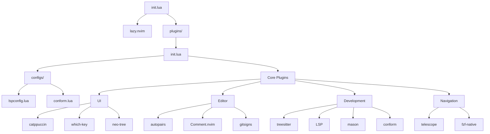

# Enhanced NVChad Configuration

A customized Neovim configuration built on top of NVChad, adding enhanced development features while maintaining NVChad's speed and elegance.



## 📁 Project Structure

```
.
├── init.lua                 # Entry point with basic settings
└── lua/
    ├── plugins/
    │   └── init.lua        # Plugin definitions
    └── configs/
        ├── lspconfig.lua   # LSP configuration
        └── conform.lua     # Formatting configuration
```

## 🚀 Features

### Core Editor Experience
- Built on NVChad's solid foundation
- Modern package management with lazy.nvim
- Optimized editor settings
- Intuitive key mappings
- Beautiful Catppuccin theme
- Git integration with gitsigns

### Development Tools
- Syntax highlighting with Treesitter
- LSP support with automatic server installation
- Autocompletion
- Snippets support
- Auto-pairs for brackets
- Smart commenting
- Code formatting with conform.nvim

### Navigation
- Fuzzy finding with Telescope
- File explorer with Neo-tree
- Buffer and window management
- Which-key for keybinding discovery

## ⚙️ Configuration Files

### init.lua
The entry point containing:
- Leader key setup (space)
- Basic editor options
- Essential keymaps
- Lazy.nvim bootstrap

### plugins/init.lua
Manages plugins including:
- UI enhancements
- Development tools
- Navigation utilities
- Git integration

### configs/lspconfig.lua
LSP configuration:
- Language server setup
- Keybindings
- Completion settings
- Diagnostic configuration

### configs/conform.lua
Formatting configuration:
- Per-language formatter settings
- Format-on-save options
- LSP integration

## 🛠️ Tools & Plugins

### UI and Theme
- **Catppuccin**: Modern, comfortable color scheme
- **Which-key**: Interactive keybinding helper
- **Neo-tree**: File explorer with git integration
- **Gitsigns**: Git change indicators

### Editor Enhancement
- **nvim-autopairs**: Automatic bracket pairing
- **Comment.nvim**: Easy code commenting
- **nvim-treesitter**: Advanced syntax highlighting
- **conform.nvim**: Code formatting

### Development
- **LSP Configuration**: Language Server Protocol support
- **Mason**: Automatic LSP server installation
- **nvim-cmp**: Autocompletion
- **LuaSnip**: Snippet engine

### Navigation
- **Telescope**: Fuzzy finder and searcher
- **telescope-fzf-native**: Fast fuzzy search

## ⌨️ Key Bindings

### General
- `<Space>` - Leader key
- `jk` - Exit insert mode
- `<leader>nh` - Clear search highlights

### Windows
- `<leader>sv` - Split window vertically
- `<leader>sh` - Split window horizontally
- `<leader>se` - Make splits equal size
- `<leader>sx` - Close current split

### Navigation
- `<C-h/j/k/l>` - Navigate splits
- `<leader>e` - Toggle file explorer
- `<leader>ff` - Find files
- `<leader>fg` - Live grep
- `<leader>fb` - Find buffers

### LSP
- `gd` - Go to definition
- `K` - Hover documentation
- `<leader>ca` - Code actions
- `<leader>rn` - Rename
- `[d/]d` - Navigate diagnostics

### Git
- View changes in gutter
- Stage/unstage hunks
- Preview changes

## 🚀 Getting Started

### Using chezmoi (Recommended)

This configuration is managed using chezmoi, a dotfile manager that helps you sync your dotfiles across multiple machines.

1. Install chezmoi:
```bash
# macOS
brew install chezmoi

# Linux
sh -c "$(curl -fsLS get.chezmoi.io)"
```

2. Initialize chezmoi with this repository:
```bash
chezmoi init https://github.com/aitchwhy/dotfiles.git
```

3. Apply the configuration:
```bash
chezmoi apply
```

This will automatically set up the Neovim configuration in the correct location.

### Manual Installation

1. Ensure you have NVChad installed:
```bash
git clone https://github.com/NvChad/NvChad ~/.config/nvim --depth 1
```

2. Clone this configuration into NVChad's custom directory:
```bash
git clone https://github.com/aitchwhy/dotfiles.git ~/.config/nvim/lua/custom
```

3. Start Neovim:
```bash
nvim
```

## 🔄 Syncing Updates

### Using chezmoi

1. Pull latest changes:
```bash
chezmoi update
```

2. Apply your local changes:
```bash
chezmoi add ~/.config/nvim
chezmoi git add .
chezmoi git commit -m "Update Neovim configuration"
chezmoi git push
```

On first launch:
- Plugins will be downloaded and installed
- LSP servers will be installed through Mason
- Formatters will be installed through Mason
- Treesitter parsers will be installed

## 📦 Requirements

- Neovim >= 0.9.0
- Git
- A C compiler for treesitter
- Node.js for LSP servers
- (Optional) ripgrep for telescope live grep
- (Optional) A Nerd Font for icons

## 🎨 Customization

### Adding Plugins
Edit `lua/plugins/init.lua` to add new plugins:

```lua
return {
  {
    "username/plugin-name",
    config = function()
      -- plugin configuration
    end,
  },
}
```

### Changing Settings
- Basic settings: Modify `init.lua`
- Plugin configurations: Modify `lua/plugins/init.lua`
- LSP settings: Modify `lua/configs/lspconfig.lua`
- Formatting settings: Modify `lua/configs/conform.lua`
